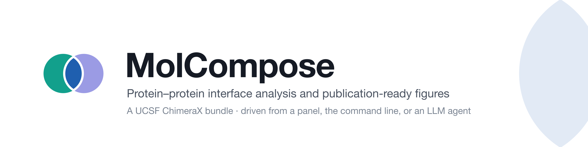
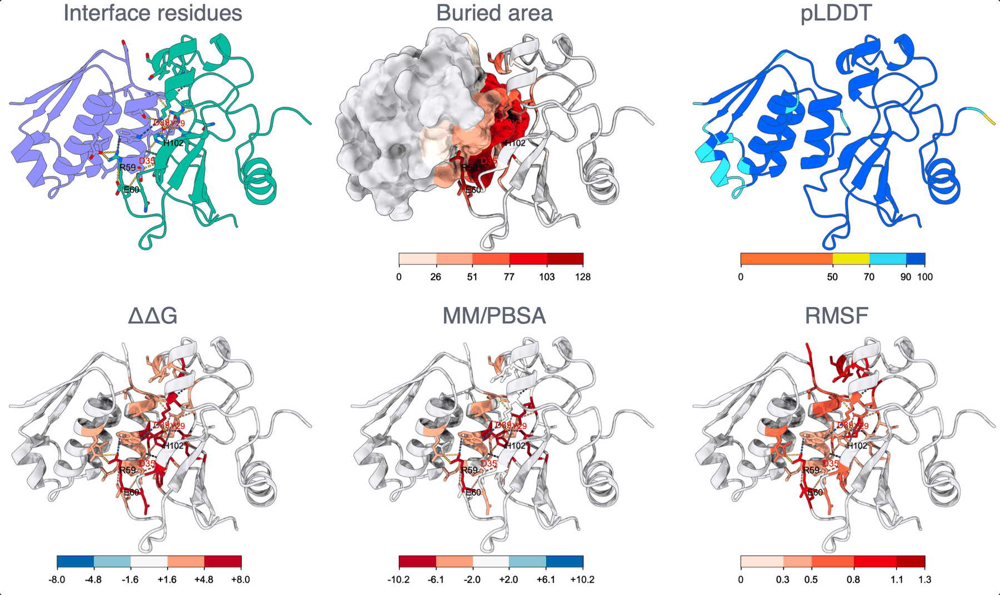
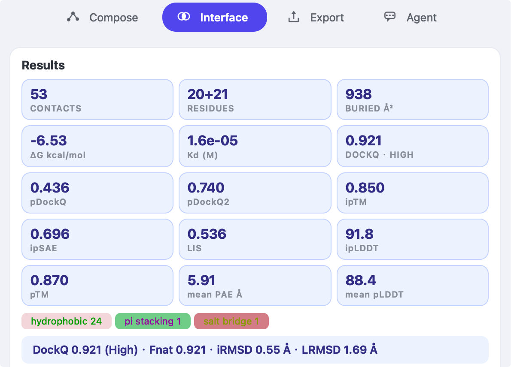
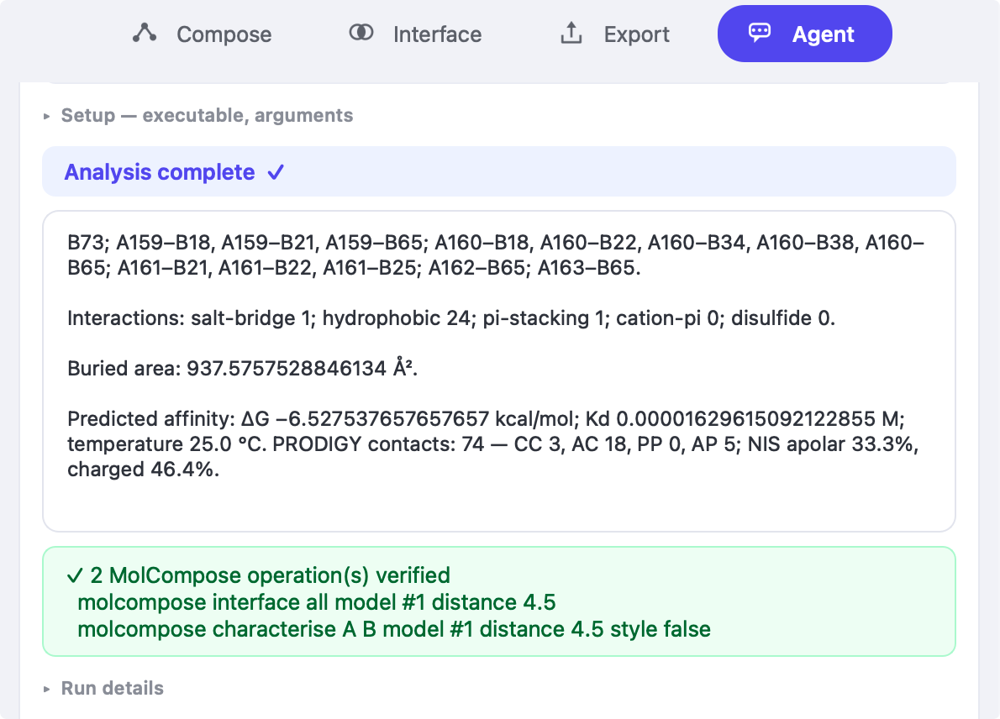

# MolCompose

<picture>
  <source media="(prefers-color-scheme: dark)" srcset="docs/assets/molcompose-banner-dark.png">
  
</picture>


<p align="center">
  <a href="https://cxtoolshed.rbvi.ucsf.edu/apps/chimeraxmolcompose"></a>
  <a href="https://www.rbvi.ucsf.edu/chimerax/"></a>
  <a href="https://pypi.org/project/molcompose-mcp/"></a>
  <a href="https://pypi.org/project/molcompose-mcp/"></a>
  <a href="https://pypi.org/project/molcompose-mcp/"></a>
  <a href="https://doi.org/10.5281/zenodo.22047284"></a>
  <a href="https://github.com/ChiaChunL/MolCompose/actions/workflows/unit-tests.yml"></a>
  <a href="https://docs.astral.sh/ruff/"></a>
  <a href="LICENSE"></a>
</p>

## 🔍 Overview

MolCompose answers the questions asked of a protein–protein interface once a
structure exists, whether it was solved or predicted: which residues form the
interface, what holds it together, how much surface it buries, how strong it
is, which residues carry it, and — for a predicted complex — whether the model
can be trusted at the interface at all.

It introduces no new analysis method. Interaction typing follows PLIP and
Arpeggio, binding energetics PRODIGY's IC-NIS model, and interface confidence
pDockQ2, ipSAE and LIS. MolCompose supplies the detection, the bookkeeping and
the figure, and names the source of every number it reports.

**Three ways in, all reaching the same 26 commands:**

- a docked panel, one button per question
- the ChimeraX command line — `molcompose characterise A D`
- an LLM agent, through the separate [`molcompose-mcp`](mcp/) server

Every command writes itself to the ChimeraX Log, whichever client issued it, so
an analysis assembled by clicking or by an agent can be replayed exactly.
Figures come from 16 named, versioned presets whose colour key is built from
the same table as the colours on the structure, so the key cannot disagree with
the figure.

MolCompose reports nothing it cannot compute: a confidence metric asked of a
crystal structure is reported as skipped, by name, rather than estimated.

- **[Command reference](docs/command-reference.md)** — all 26 commands, arguments, returns
- **[Examples](examples/)** — one worked case you can clone and run

## 📦 Installation

### From the ChimeraX Toolshed — the normal route

Inside ChimeraX, open **Tools → More Tools…**, find MolCompose and install it.
Or, on the ChimeraX command line:

```
toolshed install ChimeraX_MolCompose
```

Restart ChimeraX, then open **Tools → Structure Analysis → MolCompose**.

### From a wheel

For a version the Toolshed does not serve yet, or to install without it, in
ChimeraX's own command line:

```
toolshed install /path/to/chimerax_molcompose-0.1.2-py3-none-any.whl
```

Restart afterwards. The bundle is not on PyPI and is not meant to be: `pip` is
the wrong installer for it, and a bundle placed in a system Python is invisible
to the viewer.

### For agents

```bash
pip install molcompose-mcp
```

Runs as a separate process and reaches ChimeraX over its REST bridge. See
[`mcp/`](mcp/) for the client configuration.

#### Setup prompt

If you have an agent CLI already, hand it the setup instead of doing it
yourself. Paste the following into any MCP-capable client that can run commands:

```
Set up MolCompose so you can drive it. In UCSF ChimeraX's command line, run
`toolshed install ChimeraX_MolCompose`, then tell me to restart ChimeraX — a
running session keeps the old modules, so the panel will not appear until it
has. Install the agent bridge with `pip install molcompose-mcp`, and register
it with yourself as an MCP stdio server: the command is `molcompose-mcp` with
arguments `--chimerax-url http://127.0.0.1:3000`. Have me run
`remotecontrol rest start port 3000 json true` in ChimeraX so the bridge has
something to talk to — if ChimeraX reports another port, use that one in both
places. Then check it works: open PDB 1BRS with `open 1brs`,
characterise the interface between chains A and D, and walk me through what you
get — which command produced each number, and what the number means. Tell me
the criterion and cutoff with every number, because they are not standard.
```

Nothing is downloaded from this repository: the bundle comes from the Toolshed,
the bridge from PyPI, and the test structure from the PDB.

The agent reaches the same commands the panel's buttons run, and the panel
reports the operations it verified rather than the agent's account of them.
Every command it issues is written to the Log as its own, and every figure it
exports carries the command recipe and an agent-provenance record. The panel's
**Agent** tab does the same setup with a button, and can run your own
already-signed-in CLI as a subprocess: MolCompose never embeds a model and
never stores an API key.

While the bridge is running, ChimeraX accepts commands on 127.0.0.1 without
authentication — from the agent and from anything else on this computer. That
is a property of ChimeraX's REST control rather than of MolCompose, so stop the
bridge when you are not using it.

If `pip install molcompose-mcp` reports that no such package exists, it has
not been published yet; install it from a clone with `pip install ./mcp`.

### From a clone, for development

From inside ChimeraX, pointing at your own checkout:

```
devel install /path/to/MolCompose exit false
```

**Restart ChimeraX afterwards**: a running session keeps the old modules, and
`devel install` builds and installs rather than linking the source tree, so
edits do not appear until it is re-run.

## 🖼️ Screenshots



**Six questions, one interface.** Barnase–barstar: which residues form the
interface, how much surface each buries, and what ΔΔG, MM/PBSA decomposition
and RMSF each say about those same residues — with pLDDT from a predicted
model of the same complex, since a crystal structure has none to report. Every
key is built from the table that painted the structure it sits under.

<details>
<summary>The panel and the agent tab</summary>

| | |
|---|---|
|  | **The panel.** One click fills the card: contacts, interface residues, buried area, ΔG and K<sub>d</sub>, the typed-interaction counts, and the confidence scores where they apply. Metrics that do not apply are named as skipped rather than estimated. |
|  | **The agent tab.** Ask in plain language. The panel reports the MolCompose operations it verified — not the agent's account of them — and each one lands in the ChimeraX Log as a command you can re-run. |

</details>

## ⚡ Five-Minute Workflow

1. `open 1brs`
2. Pick the model in the panel's **Current Structure** section.
3. Apply the **Complex by Chain** preset.
4. Select chain A as Group A and chain D as Group B, then **Detect Interface**.
5. **Show Interface** to emphasize interface residues and fit the view.
6. **Export PNG** (2400×1800, supersample 3), optionally saving a session.

## 📖 Command Reference

**[Full command reference](docs/command-reference.md)** — every command, its
arguments and what it returns.

The synopsis below is a cheat sheet. It has gone stale before and was missing
`blocks`, `color by` and `source` when the generated table was first built.

```text
molcompose style <preset> [model <model-spec>] [labels <n>]
                 [references <model-spec,...>] [align <chain>] [partner <chain>]
molcompose interface <group-a> <group-b> [model <model-spec>]
                     [distance 4.5] [criterion heavy]
molcompose interface all [model <model-spec>] [distance 4.5]
molcompose focus [model|interface] [model <model-spec>]
molcompose hbonds [model <model-spec>] [off false]
molcompose contacts [model <model-spec>] [off false]
molcompose characterise <group-a> <group-b> [model <model-spec>]
                       [distance 4.5] [criterion heavy] [style true]
molcompose report <path> [model <model-spec>] [format json|csv|md]
molcompose buriedarea [model <model-spec>]
molcompose hotspots [model <model-spec>] [minArea 10] [top 0]
                    [metric dsasa|energy]
molcompose ddg <path> [model <model-spec>] [format tabular|pythia]
               [statistic min|max|mean] [top 15]
molcompose energy <decomp.dat> chains <file:model,...> [model <model-spec>]
                  [top 10] [solvation gb|pb]
molcompose affinity [model <model-spec>] [temperature 25]
molcompose interactions [model <model-spec>] [types <list>] [off false]
                       [saltBridge 4.0] [hydrophobic 4.5]
                       [piStacking 5.5] [cationPi 6.0]
molcompose dockq <reference> [model <model-spec>] [chainMap A:C,B:D]
molcompose capabilities [model <model-spec>] [predictor <name>] [paeFile <path>]
molcompose confidence [model <model-spec>]
molcompose ipsae <pae-file> [model <model-spec>] [paeCutoff 10]
molcompose export <path.png|.tif> [width 2400] [height 1800] [supersample 3]
                  [transparent false] [saveSession false] [overwrite false]
                  [dpi 300] [saveRecipe false] [keyFontSize <pixels>]
molcompose seqcolor [<path.scf>] [model <model-spec>]
                    [source interface|plddt|ddg|dsasa|bfactor|mmpbsa]
                    [statistic min|max|mean] [load true|false]
molcompose reset [model <model-spec>]
```

Presets, in two groups. Whole structure: `clean-cartoon`,
`complex-by-chain`, `surface-complex` (the whole assembly as a surface, one
colour per chain — the shape question a ribbon cannot answer), `metric-map`,
`predicted-structure` (pLDDT confidence coloring with automatic 0–1 / 0–100
scale detection). Interface, all of which
need a detected interface first: `interface-focus`, `flat-outline`,
`licorice-closeup`, `licorice-chain`, `epitope-surface`, `surface-partner-a`,
`surface-translucent`, `surface-epitope-map`, `paratope-closeup`,
`hotspot-focus`. The four `surface-*` styles draw one chain group as a
surface and leave the other a cartoon; which group becomes the surface is
named by the preset, since chain order is a property of the file rather than
of the question being asked. Full reference:
`src/docs/user/commands/molcompose.html` (installed into ChimeraX Help).

The command-only `design-reference` style overlays one or more reference
structures on a characterised design. It derives the epitope from the active
interface rather than from hard-coded residue numbers; for example:
`molcompose style design-reference model #1 references #2,#3 align A partner B`.

`molcompose seqcolor` writes the per-residue colouring as an SCF file and loads
it into the ChimeraX Sequence Viewer, so the same quantity that colours the
structure can be read along the sequence. Colours come from the functions that
paint the structure — the AlphaFold band table for pLDDT, the diverging and
sequential ramps for ΔΔG and buried area, the interface preset's own colours
for interface membership — so the two views cannot disagree about what a colour
means. One file per chain, because SCF positions are alignment columns of a
single sequence; those columns are *not* residue numbers, which is why the
mapping goes through ChimeraX's own chain sequence (3SGB chain E starts at
residue 16 and its residue numbers differ from its column numbers in fifteen
distinct ways).

## 🧬 Interface Definition

Residues from Group A and Group B are interface residues when any selected
atom of one lies within the cutoff distance (inclusive) of any selected atom
of the other. The default `heavy` criterion uses all non-hydrogen atoms with a
4.5 Å default cutoff; the `cbeta` criterion uses one Cβ point per residue
(Cα for glycine), where 8.0 Å is the conventional cutoff. The accepted range
is 2.0–10.0 Å for both. Hydrogens,
waters, ions, and non-polymer ligands are excluded; groups must not overlap.
Results are reported with stable ordering.

## 💾 What it exports

| | |
|---|---|
| **Figure** | PNG or TIFF, sized by print width in millimetres at a chosen dpi |
| **Session** | an optional `.cxs` beside the image, so the scene reopens as it was |
| **Recipe** | the commands that produced the figure, in the Log and optionally to a file |
| **Report** | `molcompose report` in Markdown, JSON or CSV |
| **Sequence colouring** | SCF, loadable into the ChimeraX Sequence Viewer |

MolCompose analyses one structure at a time. For batch work over many predicted
models, see foldmetrics.

## 🧪 Examples

[`examples/`](examples/) carries one worked case: barnase–barstar, PDB 1BRS
chains A and D, with the files each analysis needs and nothing else. The
Pythia-PPI saturation scan, the MM/PBSA decomposition and RMSF from a 100 ns
trajectory with the repaired structure they are numbered against, and one
prediction left exactly as the engine wrote it. It is about a megabyte, so a
clone is quick and every command in the [examples guide](examples/README.md)
runs against what is in front of you.

The full dataset, three complexes with six prediction engines each, the
deposited references and the MD inputs and reports, is archived on Zenodo
instead.

> **Example dataset:** <https://doi.org/10.5281/zenodo.22047284>

## 🖥️ Supported Environment

The bundle declares `ChimeraX-Core ~=1.0` and is developed and tested on
**macOS with ChimeraX 1.12**.

## 📄 Citation

A manuscript describing MolCompose has been submitted.

<!-- "manuscript", not the journal's name for its article type: naming the
     type says where it went, and that is not public until it is accepted.

     Three states, three wordings, and they are not interchangeable:
     "in preparation" until it goes out, "has been submitted" from then, and
     the reference itself once it is accepted. Not "under review" — that is
     the editor having sent it to reviewers, a later step, and one you may
     never be told happened.

     On acceptance: put the reference here, and the PubMed ID into the
     Toolshed listing's Citation field, which renders it as a formatted
     citation on that page. -->

## ⚖️ License

BSD-3-Clause. See `LICENSE`.
